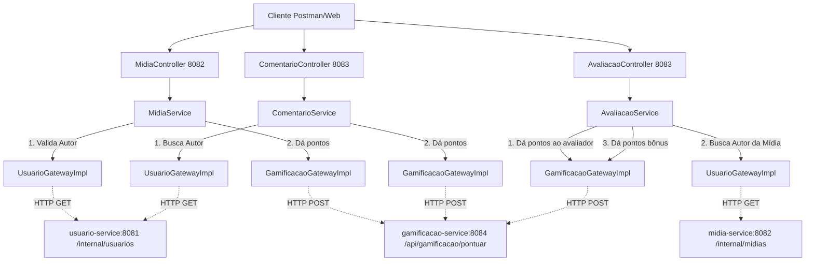

# Caderno Digital Colaborativo - Resumo da Arquitetura

O **Caderno Digital Colaborativo** foi reestruturado de uma aplicação monolítica para uma arquitetura baseada em **Microsserviços**, aplicando os princípios do **Domain-Driven Design (DDD)**. 

O sistema foi decomposto em 4 contextos delimitados (_Bounded Contexts_), cada um gerido por seu próprio microsserviço independente. O isolamento abrange desde a infraestrutura de código até o banco de dados e execução em contêineres Docker.

---

## 1. Visão Geral dos Microsserviços

| Serviço | Porta | Banco de Dados | Responsabilidade Principal |
|---------|-------|----------------|-----------------------------|
| **usuario-service** | 8081 | H2 (usuarios_db) | Gestão do ciclo de vida de Usuários (Alunos e Professores). |
| **midia-service** | 8082 | H2 (midias_db) | Upload e listagem de cadernos e materiais (mídias). |
| **interacao-service** | 8083 | H2 (interacoes_db) | Comentários em materiais e respostas, além das avaliações (1 a 5 estrelas). |
| **gamificacao-service** | 8084 | H2 (gamificacao_db) | Atribuição de pontos pelas interações e montagem do ranking. |

---

## 2. Fluxo da Arquitetura Interna (DDD)

Dentro de cada microsserviço, o código está dividido em 4 camadas que seguem o fluxo de dependência apontando para o centro (Domínio):

1. **Presentation (Apresentação)**: Controladores REST (`XController`) que recebem as requisições HTTP, convertem o JSON para DTOs e repassam para a camada de Aplicação.
2. **Application (Aplicação)**: Classes de Serviço (`XService`) que orquestram a regra de negócio. Elas não conhecem JPA ou chamadas HTTP externas. Elas dependem de repositórios de domínio e *Gateways* (para comunicação com outros microsserviços).
3. **Domain (Domínio)**: Modelos de domínio puramente Java (`Comentario`, `Midia`, `Usuario`), que contêm os dados centrais sem as anotações do banco de dados, e interfaces de repositórios (`XDomainRepository`).
4. **Infrastructure (Infraestrutura)**: Camada mais externa que realiza E/S (Entrada e Saída). Implementa as interfaces de repositório via JPA (`XDomainRepositoryImpl` chamando `XJpaRepository`), define *Entities* (`XEntity`), gerencia acesso externo usando RestTemplate (`XGatewayImpl`) e configura o Spring.

**Exemplo de Fluxo (Criação de Comentário):**
`ComentarioController` ➔ `ComentarioRequest DTO` ➔ `ComentarioService` ➔ `ComentarioDomainRepository` ➔ `ComentarioDomainRepositoryImpl` ➔ `ComentarioJpaRepository` ➔ Grava no Banco H2.

---

## 3. Comunicação Inter-serviços

Os microsserviços não compartilham banco de dados. Eles comunicam-se de forma **síncrona via HTTP REST**.

*O Padrão Gateway*: A camada de aplicação de um serviço define uma interface de gateway (ex: `UsuarioGateway`), que é implementada na infraestrutura para disparar `RestTemplate` para as rotas `/internal/...` dos outros serviços.

### Fluxos de Chamada de Classes:

- **Mídia Criada**: O `MidiaService` acessa o `UsuarioGatewayImpl` que dispara uma chamada HTTP para o `/internal/usuarios/{id}` do `usuario-service` validando o usuário. Logo depois, acessa o `GamificacaoGatewayImpl` que chama o `/api/gamificacao/pontuar` creditando **10 pontos** (Ação: ENVIO_MIDIA).
- **Comentário Feito**: O `ComentarioService` valida o autor chamando o `usuario-service` e depois credita pontos chamando o `gamificacao-service`.
- **Avaliação (5 estrelas)**: Ao dar 5 estrelas em uma mídia, o `AvaliacaoService` chama o `gamificacao-service` para pontuar quem avaliou, DEPOIS chama o `midia-service` para descobrir quem é o dono da mídia (para dar pontos bônus de "Contribuição Bem Avaliada"), e depois chama novamente o `gamificacao-service` para pontuar o autor da mídia!

---

## 4. Resiliência e Docker

O arquivo `docker-compose.yml` inicia tudo.
O *healthcheck* foi implementado: O serviço de `midia` e `interacao` **somente** são iniciados (Started) se, e somente se, o `usuario-service` estiver operando e respondendo na porta HTTP adequadamente.
